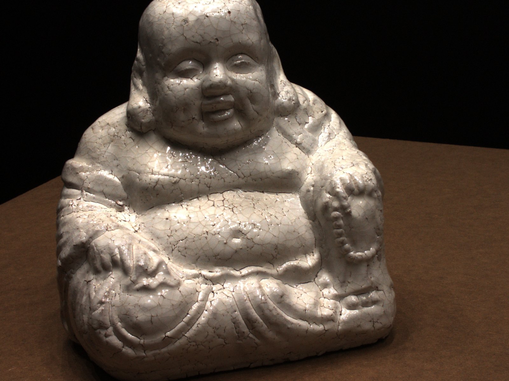

<div align="center">
<h1>FINS: Fast Image-to-Neural Surface</h1>

<h3 align="center">
  <a href="https://arxiv.org/abs/2509.20681"></a>
  <a href="https://waynechu1109.github.io/fins.github.io/"></a>
</h3>

[Wei-Teng Chu](https://www.linkedin.com/in/waynechu1109), [Tianyi Zhang](https://www.linkedin.com/in/tianyi-zhang-396b0a186/), [Matthew Johnson-Roberson](https://www.linkedin.com/in/mattkjr/), [Weiming Zhi](https://www.linkedin.com/in/williamzhi/)

<p align="center">
  
  
  
</p>

</div>

```bibtex
@misc{chu2025fins,
  title         = {Efficient Construction of Implicit Surface Models From a Single Image for Motion Generation}, 
  author        = {Wei-Teng Chu and Tianyi Zhang and Matthew Johnson-Roberson and Weiming Zhi},
  year          = {2025},
  eprint        = {2509.20681},
  archivePrefix = {arXiv},
  primaryClass  = {cs.RO},
  url           = {https://arxiv.org/abs/2509.20681}, 
}
```

## Overview
**FINS: Fast Image-to-Neural Surface** reconstructs high-fidelity signed distance fields (SDFs) from as little as a single RGB image in just a few seconds.

Unlike traditional neural surface methods that require dense multi-view supervision and long optimization times, FINS leverages pretrained 3D foundation models to generate geometric priors, combined with multi-resolution hash encoding and lightweight SDF heads for rapid convergence.

The resulting implicit representation enables real-time surface reconstruction and supports downstream robotics tasks such as motion planning, obstacle avoidance, and surface following.

FINS bridges single-image perception and fast neural implicit modeling, making SDF construction practical for real-world robotic systems.

## Quick Start
```bash
git clone https://github.com/waynechu1109/FINS.git
cd FINS
```

### Conda
```bash
conda create -n FINS python=3.10
conda activate FINS

pip install -r requirements.txt
```

### Docker
```bash
# pull docker image from docker hub
sudo docker pull waynechu1109/droplab_research:latest

# run docker  
docker run -it --gpus all \
  -p 8000:8000 \
  -e DISPLAY=$DISPLAY \
  -v /tmp/.X11-unix:/tmp/.X11-unix \
  -v /home/waynechu/FINS:/FINS \
  -v /etc/passwd:/etc/passwd:ro \
  -v /etc/group:/etc/group:ro \
  --name FINS \
  waynechu1109/droplab_research:latest /bin/bash

pip install -r requirements.txt
```

### Dataset Preparation
- We used DTU Training dataset for experiments. Please download the preprocessed DTU dataset provided by [MVSNet](https://drive.google.com/file/d/1eDjh-_bxKKnEuz5h-HXS7EDJn59clx6V/view).
- The data should be prepared in the structure as:
```bash
data/
├── dtu_105_09/
│   └── dtu_105_09.png
├── dtu_108_32/
│   └── dtu_108_32.png
└── ...
```
- You can also try custom data.

### Image Preprocess
Clone VGGT first.
```bash
# clone VGGT for preprocess data
mkdir deps && cd deps
git clone https://github.com/facebookresearch/vggt.git
cd ..
```

The image should be placed in ```data/<image_name>/<image_name>.png```. VGGT can generate point cloud with only a single image.

```bash
cd tools

# vggt preprocess
python3 vggt_pointcloud_generate.py --file dtu_118_60 --thres 65 --max_points 90000
```
- To tune the confidence threshold in percentage, set ```--thres```.
- When the scene is concave, set ```--concave true```. The direction of point clouds' normals are important for the training.
- When the computing resource is limited, set ```--max_points```. The default value is 200,000. You can also tune higher if higher mesh quality is needed. 

For more options, see ```python3 vggt_pointcloud_generate.py -h```. 

After preprocess, you can find the preprocessed point cloud file in ```data/vggt_preprocessed/<file_name>```. It is convenient to view preprocessed point clouds with F3D. You can simply install it with ```sudo apt install f3d```.

### Training and Inferring
The script for the whole pipeline can be found in ```scripts/experiment.sh```, which include the commands for both training and inferring. If you want to run series trainging (for example, multiple scenes at a single run), see ```scripts/run_exp_series.sh```.

```bash
# Start series training
./scripts/run_exp_series.sh
```
The results can be found in ```output/```.

<!-- ### Results
The mesh render script can also be found in ```/tools``` folder. You can render the result mesh with the commands below:
```bash
cd tools
python3 mesh_video_render.py --input <path_to_output_mesh>
```
- To show color, set ```--colored```. -->

<!-- You can download the [DTU results](https://connecthkuhk-my.sharepoint.com/:f:/g/personal/xxlong_connect_hku_hk/EpvCB9YC1FZEtrsrbEkd8AwBGdnymfTQLJIdXFIeIOcqsw?e=3hb9Zn) and [BMVS results](https://connecthkuhk-my.sharepoint.com/:f:/g/personal/xxlong_connect_hku_hk/EpLOwBek671NmgzmmLresT0Bt9JKgIYBkHogeQsukzfttQ?e=rodRih) of the paper reports here. -->

<!-- ## Evaluation
The output iso-surface reconstruction result can be evaluated with ground truth mesh with the command below:
```bash
cd tools
python3 chamfer_dist_eval.py --result_mesh <path_to_output_mesh> --gt_mesh <path_to_gt_mesh>
``` -->

## Acknowledgements

This project would not have been possible without prior work such as [VGGT](https://github.com/facebookresearch/vggt) and [DUSt3R](https://github.com/naver/dust3r). We thank the authors of these works and the broader research community for making this project possible.

## Citation

If you find this repository useful, please cite our arXiv paper:

```bibtex
@misc{chu2025fins,
  title         = {Efficient Construction of Implicit Surface Models From a Single Image for Motion Generation}, 
  author        = {Wei-Teng Chu and Tianyi Zhang and Matthew Johnson-Roberson and Weiming Zhi},
  year          = {2025},
  eprint        = {2509.20681},
  archivePrefix = {arXiv},
  primaryClass  = {cs.RO},
  url           = {https://arxiv.org/abs/2509.20681}, 
}
```
